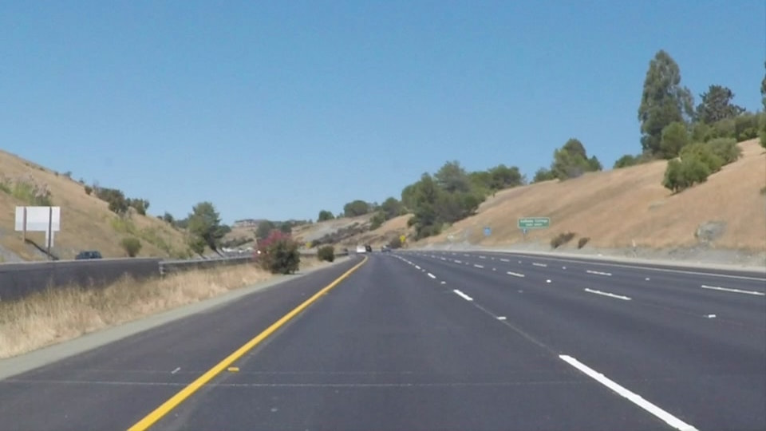

# **Finding Lane Lines on the Road** 
---

## 1. Pipeline Overview

- describe the pipeline
-- convert to gray scale
-- run canny on image
-- apply region of interest
-- draw hough lines
-- overlay the lines onto the original image with transparency
- describe draw_lines()
-- determine slope and y-intercept for each set of points
-- select all lines with slope between 0.4 & inf
-- draw line with average values from left and right
- describe process_image()
-- run process image, and catch instances where no lines are found

 
![alt text][image3]
![alt text][image4]
![alt text][image5]
![alt text][image6]

## 2. Shortcomings of Current Pipeline

One potential shortcoming would be what would happen when ... 

Another shortcoming could be ...

## 3.Possible Pipeline Improvements

A possible improvement would be to ...

Another potential improvement could be to ...

[//]: # (Image References)

[image1]: ./examples/original.jpg  "Original"
[image2]: ./examples/grayscale.jpg "Grayscale"
[image3]: ./examples/canny.jpg     "Canny"
[image4]: ./examples/roi.jpg       "Region of Interest"
[image5]: ./examples/houghline.jpg "Houghs Lines"
[image6]: ./examples/weighted.jpg  "Weighted Image"
